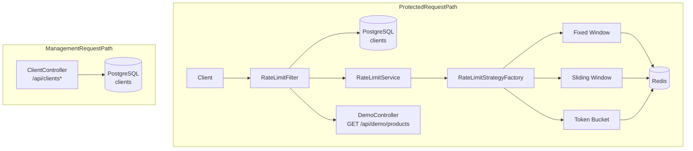

# ReqForge

> A Redis-backed API rate limiting service built with Java 21 and Spring Boot.

## 2. Badges


## 3. Overview

ReqForge enforces per-client request quotas for HTTP endpoints. Each request is associated with a client by an API key supplied via the `X-API-Key` header.

Client configuration (status, rate-limit algorithm, request limit, and window seconds) is stored in PostgreSQL. For request enforcement, ReqForge uses Redis to maintain rate-limit state and Redis Lua scripts to evaluate and update the state atomically.

## 4. Key Features

- API-key based client identification via `X-API-Key`
- Configurable per-client rate limits (`requestLimit`, `windowSeconds`, algorithm)
- Centralized enforcement using a Spring `OncePerRequestFilter` (`RateLimitFilter`)
- Fixed Window, Sliding Window, and Token Bucket algorithms
- Atomic Redis Lua scripts for rate-limit evaluation/update
- Rate-limit response headers:
  - `X-RateLimit-Limit`
  - `X-RateLimit-Remaining`
  - `X-RateLimit-Reset`
  - `Retry-After` on `429`
- HTTP error responses for:
  - `401`, `403`, `429`, `503`
- Persistent client configuration via Spring Data JPA + PostgreSQL
- Health/metrics endpoints via Spring Boot Actuator
- Local multi-container execution via Docker Compose (PostgreSQL + Redis)
- End-to-end integration tests using Testcontainers (real PostgreSQL + Redis)
- GitHub Actions CI workflow running `mvn clean test`

## 5. Architecture



**Request flow (high-level):**

`Client → RateLimitFilter → API key validation → client configuration lookup → strategy selection → Redis (Lua enforcement) → allow/reject → controller`

Rate-limit enforcement is centralized in the filter, which prevents duplicating quota logic in individual protected controllers.

## 6. How Rate Limiting Works

1. A client sends an HTTP request containing `X-API-Key`.
2. `RateLimitFilter` validates that the key maps to a known client.
3. The filter loads the client configuration (status, algorithm, `requestLimit`, `windowSeconds`) from PostgreSQL.
4. The filter checks client status (`ACTIVE` vs `INACTIVE`).
5. The filter calls `RateLimitService`, which selects the configured strategy via `RateLimitStrategyFactory`.
6. The selected strategy executes a single Redis Lua script to update/evaluate rate-limit state.
7. The filter receives a `RateLimitResult` and adds rate-limit headers.
8. If allowed, the request reaches the controller. If rejected, the filter returns an error response.

**Outcome status codes**

- **401** → missing or invalid `X-API-Key`
- **403** → client is present but marked `INACTIVE`
- **429** → rate limit exceeded
- **503** → rate limiter/Redis dependency unavailable (fail-closed)

## 7. Rate-Limiting Algorithms

### Fixed Window

- Discrete time windows based on epoch seconds and `windowSeconds`.
- Redis stores a counter per `(apiKey, windowId)`.
- Lua increments the counter and initializes expiry when the counter is first created for the window.
- A request is rejected once the counter exceeds `requestLimit`.

**Example (Limit = 5, Window = 60 seconds):**

1 → allowed
2 → allowed
3 → allowed
4 → allowed
5 → allowed
6 → 429

### Sliding Window

- Requests are evaluated over a rolling interval of length `windowSeconds`.
- Redis uses a Sorted Set (ZSET) to store request timestamps.
- Before counting, expired entries older than `now - windowSeconds` are removed.
- The request is allowed while the active entry count is below `requestLimit`; otherwise it is rejected.

### Token Bucket

- Redis stores a bucket state per client using a hash containing `tokens` and `lastRefillSeconds`.
- Refill is computed lazily during request evaluation using a refill rate derived from `requestLimit / windowSeconds`.
- If at least 1 token is available, 1 token is consumed and the request is allowed. Otherwise, the request is rejected.

**Configuration mapping:**

- `requestLimit` → bucket capacity
- `windowSeconds` → basis for refill-rate calculation

## 8. Redis Design

| Algorithm | Redis Structure | Purpose |
|-----------|-----------------|---------|
| Fixed Window | String counter (`INCR` + conditional `EXPIRE`) | Count requests per discrete window |
| Sliding Window | Sorted Set (ZSET) | Store timestamps; remove expired entries |
| Token Bucket | Hash (HSET) | Store `tokens` and `lastRefillSeconds` |

Redis key naming conventions used by the implementation:

- Fixed Window: `rate_limit:fixed:{apiKey}:{windowId}`
- Sliding Window: `rate_limit:sliding:{apiKey}`
- Token Bucket: `rate_limit:bucket:{apiKey}`

## 9. Atomicity and Concurrency

Rate-limit enforcement can require multiple Redis operations (e.g., reading state, computing remaining quota, and updating expiry). If these steps were performed as separate Redis commands, concurrent requests could interleave and lead to inconsistent decisions.

ReqForge evaluates and updates rate-limit state using Redis Lua scripts (`fixed-window.lua`, `sliding-window.lua`, `token-bucket.lua`) executed via `StringRedisTemplate.execute(...)`.

**Atomic work performed by each script** (per enforcement decision):

- **Fixed Window**: `INCR` the counter and set `EXPIRE` when the counter becomes `1`.
- **Sliding Window**: remove expired timestamps (`ZREMRANGEBYSCORE`), count active entries (`ZCARD`), conditionally `ZADD` a timestamp, then set `EXPIRE`.
- **Token Bucket**: read `tokens`/`lastRefillSeconds` (`HGET`), compute refill and allowed vs rejected, then update (`HSET`) and set `EXPIRE`.

**Concurrency testing approach**

- `RateLimitConcurrencyTest` runs multi-threaded checks against strategy implementations using a mocked `StringRedisTemplate` and a synchronized in-memory emulation of the expected atomic behavior.
- `RateLimitE2ETest` validates end-to-end request handling against real PostgreSQL + Redis containers and includes a fail-closed Redis-unavailable scenario.

## 10. Data Storage

### PostgreSQL

PostgreSQL stores persistent client configuration used during rate-limit evaluation.

The `Client` entity fields include:

- `id`
- `name`
- `apiKey`
- `status` (`ACTIVE` / `INACTIVE`)
- `rate_limit_algorithm` (`FIXED_WINDOW`, `SLIDING_WINDOW`, `TOKEN_BUCKET`)
- `requestLimit`
- `windowSeconds`
- `createdAt`
- `updatedAt`

### Redis

Redis stores the temporary, high-frequency rate-limit state updated during request enforcement:

- Fixed Window: per-window counter key with expiry
- Sliding Window: per-client Sorted Set (timestamps) with expiry
- Token Bucket: per-client hash containing `tokens` and `lastRefillSeconds` with expiry

Separating persistent configuration (PostgreSQL) from rate-limit state (Redis) keeps client management durable while keeping enforcement fast.

## 11. API Endpoints

### Client management (not rate-limited)

These endpoints are excluded from `RateLimitFilter` by path (requests to `/api/clients*`).

| Method | Path | Purpose | Required headers | Important status codes |
|---|---|---|---|---|
| `POST` | `/api/clients` | Create a client and generate an API key | `Content-Type: application/json` | `201`, `400` |
| `GET` | `/api/clients` | List all clients | none | `200` |
| `GET` | `/api/clients/{id}` | Fetch a client by UUID | none | `200`, `404` |
| `PUT` | `/api/clients/{id}` | Update client configuration | `Content-Type: application/json` | `200`, `400`, `404` |
| `DELETE` | `/api/clients/{id}` | Delete a client | none | `204`, `404` |

### Protected endpoint (rate-limited)

| Method | Path | Purpose | Required headers | Important status codes |
|---|---|---|---|---|
| `GET` | `/api/demo/products` | Demo endpoint protected by rate limiting | `X-API-Key: <apiKey>` | `200`, `401`, `403`, `429`, `503` |

### Actuator endpoints

| Method | Path | Purpose |
|---|---|---|
| `GET` | `/actuator/health` | Health status (details hidden) |
| `GET` | `/actuator/metrics` | Metrics exposed by Micrometer |

## 12. Client Creation Example

### Create a client

```http
POST /api/clients
Content-Type: application/json

{
  "name": "demo-client",
  "requestLimit": 100,
  "windowSeconds": 60,
  "algorithm": "SLIDING_WINDOW"
}
```

Representative response (`201 Created`, shape):

```json
{
  "id": "<uuid>",
  "name": "demo-client",
  "apiKey": "ask_live_xxxxxxxxxxxxxxxx",
  "status": "ACTIVE",
  "requestLimit": 100,
  "windowSeconds": 60,
  "algorithm": "SLIDING_WINDOW",
  "createdAt": "<ISO-8601 timestamp>",
  "updatedAt": "<ISO-8601 timestamp>"
}
```

## 13. Protected API Example

### Allowed request

```http
GET /api/demo/products
X-API-Key: ask_live_xxxxxxxxxxxxxxxx
```

Representative success response (`200 OK`) includes rate-limit headers:

```http
X-RateLimit-Limit: <limit>
X-RateLimit-Remaining: <remaining>
X-RateLimit-Reset: <resetSeconds>
```

### Rejected request (rate limit exceeded)

```http
GET /api/demo/products
X-API-Key: ask_live_xxxxxxxxxxxxxxxx
```

Representative `429 Too Many Requests` response includes:

```http
X-RateLimit-Limit: <limit>
X-RateLimit-Remaining: 0
X-RateLimit-Reset: <resetSeconds>
Retry-After: <resetSeconds>
```

Representative `429` body shape:

```json
{
  "timestamp": "<ISO-8601 timestamp>",
  "status": 429,
  "error": "Too Many Requests",
  "message": "Rate limit exceeded",
  "path": "/api/demo/products"
}
```

## 14. Error Handling

| Status | Meaning |
|---:|---|
| `400` | Invalid client/configuration request (validation / argument errors) |
| `401` | Missing or invalid API key (`X-API-Key`) |
| `403` | Client is inactive (`status != ACTIVE`) |
| `429` | Rate limit exceeded |
| `503` | Rate limiter/Redis dependency unavailable (fail-closed) |

## 15. Tech Stack

| Technology | Purpose |
|---|---|
| Java 21 | Runtime |
| Spring Boot | Application framework |
| Spring Web | REST controllers and HTTP request handling |
| Spring Data JPA | PostgreSQL persistence |
| PostgreSQL | Persistent client configuration |
| Spring Data Redis | Redis integration |
| Redis Lua | Atomic rate-limit enforcement scripts |
| Redis | Rate-limit state |
| Micrometer / Actuator | Health and metrics |
| Maven | Build and dependency management |
| JUnit 5 | Testing |
| Mockito | Unit testing / mocking |
| MockMvc | Controller/filter tests |
| RestAssured | HTTP-level end-to-end tests |
| Testcontainers | Real PostgreSQL/Redis integration tests |
| Docker Compose | Local multi-container environment |

## 16. Project Structure

```text
ReqForge/
├── src/
│   ├── main/
│   │   ├── java/com/apishield/
│   │   │   ├── controller/
│   │   │   ├── filter/
│   │   │   ├── service/
│   │   │   ├── entity/
│   │   │   └── exception/
│   │   └── resources/
│   │       ├── application.yml
│   │       ├── application-docker.yml
│   │       └── scripts/
│   │           ├── fixed-window.lua
│   │           ├── sliding-window.lua
│   │           └── token-bucket.lua
│   └── test/
│       └── java/com/apishield/
│           └── integration/
│               ├── BaseIntegrationTest.java
│               └── RateLimitE2ETest.java
├── .github/workflows/ci.yml
├── Dockerfile
├── docker-compose.yml
├── .env.example
├── .dockerignore
├── pom.xml
└── README.md
```

## 17. Requirements

### Local development

- Java 21
- Maven
- PostgreSQL
- Redis

### Containerized development

- Docker Engine or compatible Docker Compose environment

### Testcontainers (end-to-end tests)

- Docker-compatible container runtime available to the test process

## 18. Installation — Local

### Clone

```bash
git clone https://github.com/absol11984/ReqForge.git
cd ReqForge
```

### Configure environment

```bash
cp .env.example .env
```

For local execution outside Docker Compose, update hostnames in `.env` to match your local PostgreSQL and Redis (for example `localhost` instead of the Compose service names).

### Run

```bash
mvn spring-boot:run
```

### Test

```bash
mvn clean test
```

## 19. Installation — Docker (recommended)

### Clone

```bash
git clone https://github.com/absol11984/ReqForge.git
cd ReqForge
```

### Configure environment

```bash
cp .env.example .env
```

### Start the stack

```bash
docker compose up --build -d
```

### Verify

```bash
docker compose ps
curl http://localhost:8080/actuator/health
```

Expected response:

```json
{"status":"UP"}
```

### View logs

```bash
docker compose logs -f api
```

### Stop

```bash
docker compose down
```

### Service overview

- `api`: ReqForge application
- `db`: PostgreSQL (client configuration)
- `redis`: Redis (rate-limit state)

## 20. Environment Variables

| Variable | Purpose | Example |
|---|---|---|
| `DB_URL` | PostgreSQL JDBC URL | `jdbc:postgresql://db:5432/apishield` |
| `DB_USERNAME` | PostgreSQL user | `replace_with_db_user` |
| `DB_PASSWORD` | PostgreSQL password | `replace_with_db_password` |
| `REDIS_HOST` | Redis hostname | `redis` |
| `REDIS_PORT` | Redis port | `6379` |
| `SERVER_PORT` | HTTP server port | `8080` |

## 21. Testing

ReqForge tests are split across multiple layers:

- **Unit tests**: strategy and service behavior (including concurrency emulation)
- **Controller/filter tests**: HTTP behavior, headers, and error mapping (using `MockMvc`)
- **Integration tests**: Spring component integration using the `test` profile
- **End-to-End tests**: real HTTP flows against PostgreSQL + Redis using Testcontainers

> The current test suite contains 58 tests and the latest verified run completed with 0 failures and 0 errors.

## 22. CI

GitHub Actions CI is configured at `.github/workflows/ci.yml`.

It runs on:

- `push` to `main`
- `pull_request` targeting `main`

The workflow performs:

- checkout
- setup Java 21 (Temurin) with Maven caching
- `mvn clean test`

## 23. Observability

Actuator endpoints exposed by configuration:

- `GET /actuator/health`: health status (details hidden via `show-details: never`)
- `GET /actuator/metrics`: Micrometer metrics

Rate-limit related Micrometer counters are registered by `RateLimitFilter`, including:

- `ratelimit.requests.total`
- `ratelimit.requests.allowed`
- `ratelimit.requests.rejected`
- `ratelimit.errors.invalid_key`
- `ratelimit.errors.inactive_client`
- `ratelimit.errors.redis_failure`

## 24. Docker Architecture

Docker Compose runs three containers:

- ReqForge API container (`api`)
- PostgreSQL container (`db`)
- Redis container (`redis`)

The application connects to PostgreSQL and Redis using Docker service names (`db` and `redis`), so container-to-container communication does not rely on `localhost`.

## 25. Security Considerations

- Requests are associated with clients using `X-API-Key`.
- The filter logs masked API keys (it does not log the full key).
- Secrets are supplied through environment variables (for local runs, use `.env`; `.env` is excluded from the Docker build context).
- Protected endpoints fail closed when Redis is unavailable, returning `503`.
- The Docker image runs the application as a non-root user.
- Actuator endpoints are exposed according to the configured management settings; additional auth is not configured in this repository.

## 26. Limitations

- Rate-limit enforcement depends on Redis for protected endpoints; when Redis is unavailable/unresponsive, protected requests are rejected with `503`.
- Rate limits are scoped to the API key (per-client), not a single shared global quota.
- Fixed Window uses discrete time boundaries.
- Token Bucket refill is computed lazily during request evaluation (no background refill job).
- End-to-End tests focus on representative flows (including Redis-unavailable fail-closed), not exhaustive timing coverage for every algorithm/path.

## 27. Design Decisions

### Why Redis?
Redis stores the request-rate state required to make enforcement decisions quickly. Each strategy uses Redis Lua scripts to perform the decision as an atomic script execution.

### Why PostgreSQL?
PostgreSQL persists client configuration and status. This separates durable management data from the high-frequency enforcement state.

### Why Strategy Pattern?
`RateLimitStrategyFactory` selects the rate-limit algorithm implementation based on the client’s configured `rate_limit_algorithm`.

### Why OncePerRequestFilter?
`RateLimitFilter` centralizes enforcement before protected controller logic runs, ensuring a consistent request gate.

### Why Lua?
Lua scripts combine the multi-step read/update/decision flow into a single Redis-side execution, preventing race conditions caused by interleaving separate Redis commands.

## 28. Roadmap

Possible future improvements (not currently implemented):

- additional end-to-end examples and timing-edge-case coverage
- additional protected endpoints and request/response examples
- optional authentication/authorization for management/observability endpoints
- additional rate-limiting policies beyond the current three algorithms
