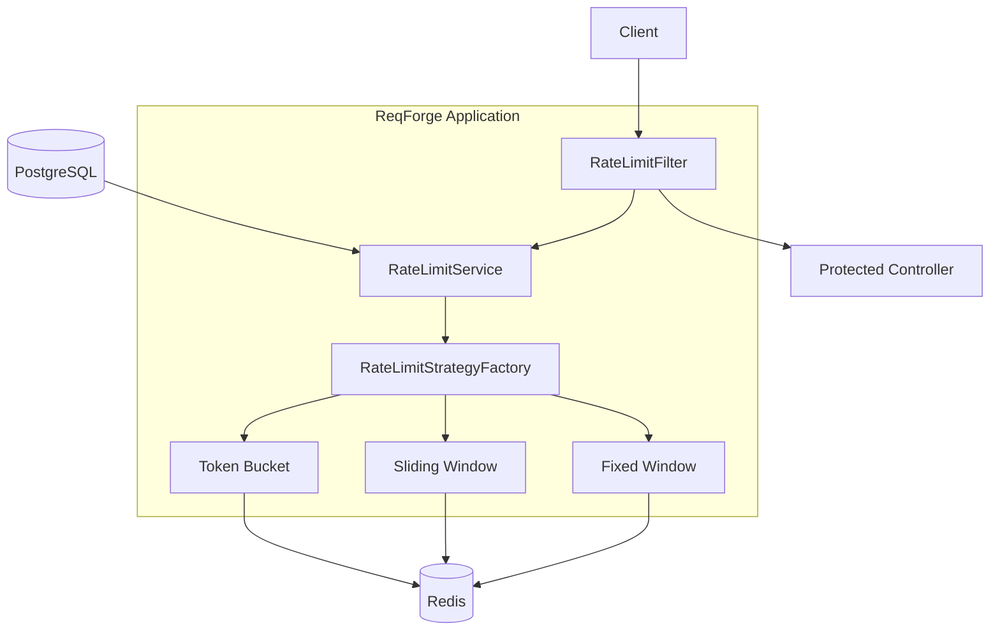

# ReqForge

> A Redis-backed API rate limiting service built with Java 21 and Spring Boot, supporting multiple rate-limiting algorithms and centralized request enforcement.


## Overview

ReqForge is a backend service designed to manage, enforce, and observe API rate limits for individual clients. It provides a dedicated layer for defending upstream services against abusive traffic or accidental denial-of-service conditions by strictly enforcing configurable request quotas. 

Clients are identified by securely generated API keys. When a request is received, the system evaluates the client's current traffic against their assigned rate-limiting algorithm. To achieve the high throughput and low latency required for request gating, ReqForge uses Redis to manage high-frequency counter state, while relying on PostgreSQL to securely durably persist client configuration rules and metadata.

## Key Features

- API-key based client access identification
- Configurable per-client request quotas and windows
- Multiple algorithms: Fixed Window, Sliding Window, Token Bucket
- Centralized `OncePerRequestFilter` logical enforcement
- Redis-backed rate-limit ephemeral state
- Atomic Redis Lua script execution for concurrency-safe state updates
- Standard HTTP rate-limit response headers
- Explicit HTTP 401, 403, 429, and 503 error handling
- PostgreSQL-backed persistent configuration
- Application health and Micrometer metrics endpoints
- Complete Docker Compose environment with healthchecks
- End-to-end integration testing using Testcontainers
- GitHub Actions CI workflow

## Architecture



**Request Flow:**
1. A request arrives from the **Client**.
2. The **`RateLimitFilter`** intercepts the request and extracts the API key.
3. The filter queries the **`RateLimitService`** which loads the client configuration from **PostgreSQL**.
4. The **`RateLimitStrategyFactory`** selects the configured algorithm Strategy (Fixed, Sliding, or Token Bucket).
5. The Strategy executes an atomic Lua script against **Redis** to determine if the quota is exceeded.
6. The filter receives the allow/reject decision and appends HTTP rate-limit headers.
7. If allowed, the request proceeds to the **Protected Controller**. If rejected, the filter terminates the request immediately with an HTTP 429 response.

Centralizing this logic in a Spring Filter prevents duplicated rate-limit evaluation logic inside specific API controllers.

## How Rate Limiting Works

1. Client sends a request containing the `X-API-Key` header.
2. `RateLimitFilter` extracts the header.
3. Client configuration (quota, algorithm, status) is loaded from PostgreSQL.
4. Client status is verified.
5. `RateLimitService` selects the specific rate limit strategy via the factory pattern.
6. The strategy executes a single, atomic Lua script against Redis.
7. Redis computes the new state and returns a result indicating whether the request is allowed, remaining tokens, and time until reset.
8. Standard `X-RateLimit-*` response headers are attached to the HTTP response.
9. The request either proceeds to the application logic or is aborted and returned to the client.

**Failure Outcomes:**
- **401 Unauthorized**: Missing or invalid API key.
- **403 Forbidden**: Client key exists but is marked inactive.
- **429 Too Many Requests**: Request limit exceeded for the active window.
- **503 Service Unavailable**: Redis is unreachable or unresponsive (systems fail closed to protect upstream services).

## Rate-Limiting Algorithms

### Fixed Window

Requests are counted inside discrete time windows based on the Unix epoch. The window size is absolute, making it computationally light.
- Uses a basic counter that expires when the discrete time window elapses.
- Susceptible to burst traffic bridging the boundary of two windows (e.g., spending the quota at the end of Window A and the beginning of Window B immediately).

**Example (Limit = 5, Window = 60s):**
`req 1` → allowed
`req 2` → allowed
`req 3` → allowed
`req 4` → allowed
`req 5` → allowed
`req 6` → 429 Too Many Requests (until next 60s boundary)

### Sliding Window

Requests are tracked over a rolling time interval exactly `windowSeconds` relative to the current timestamp.
- Redis tracks request timestamps.
- Expired requests are dynamically removed before determining the current valid count.
- Prevents the boundary burst issue present in Fixed Window by calculating limits continuously.

### Token Bucket

Requests consume tokens from a theoretical bucket that continuously refills at a fixed rate over time.
- The capacity is equal to the client's `requestLimit`.
- The refill rate is dynamically calculated based on `requestLimit / windowSeconds`.
- Token calculation is evaluated lazily upon request arrival rather than via background worker threads.
- Allows for controlled bursts of traffic up to the maximum limit, spacing out recovery.

## Redis Design

The implementation actively provisions different Redis data structures to optimally support each algorithmic approach.

| Algorithm | Redis Structure | Purpose |
|-----------|-----------------|---------|
| Fixed Window | String / counter | Maintain discrete incrementing count |
| Sliding Window | Sorted Set (ZSET) | Track request timestamps dynamically |
| Token Bucket | Hash (HSET) | Store distinct tokens and last-refill state |

**Key Naming Conventions:**
- Fixed Window: `rate_limit:fixed:{apiKey}:{windowId}`
- Sliding Window: `rate_limit:sliding:{apiKey}`
- Token Bucket: `rate_limit:bucket:{apiKey}`

## Atomicity and Concurrency

When rate limit evaluation dictates state inspection, recalculation, and mutation, multi-step Redis commands create race conditions under concurrent client load. ReqForge avoids these race conditions entirely by utilizing **Redis Lua Scripts**.

The Java strategies perform zero state calculations in memory. Instead, properties are passed to `fixed-window.lua`, `sliding-window.lua`, and `token-bucket.lua` files. Redis executes these scripts atomically, meaning concurrent evaluations against the same client key cannot interleave.

This atomicity is validated through concurrent `CountDownLatch` load tests ensuring exactly the configured limit of requests passes, regardless of multi-threaded contention.

## Data Storage

Responsibility is strictly partitioned between two distinct persistence systems.

**PostgreSQL**:
- Holds durable client configuration.
- Fields: `id`, `name`, `apiKey`, `status`, `requestLimit`, `windowSeconds`, `algorithm`, `createdAt`, `updatedAt`.

**Redis**:
- Manages high-frequency rate-limit tracking.
- Ephemeral counters, rolling timestamp sets, and fluid bucket states.

This separation prevents high-throughput traffic inspection from overwhelming the primary relational database utilized for business and configuration data.

## API Endpoints

### Client Management

These administrative endpoints bypass rate-limiting.

| Method | Path | Purpose | Success |
|---|---|---|---|
| `POST` | `/api/clients` | Register a client, generate API key | 201 |
| `GET` | `/api/clients` | List all registered clients | 200 |
| `GET` | `/api/clients/{id}` | Get client configuration by UUID | 200 |
| `PUT` | `/api/clients/{id}` | Update client quotas / algorithms | 200 |
| `DELETE` | `/api/clients/{id}` | Delete a client permanently | 204 |

### Protected Application

| Method | Path | Purpose | HTTP Header Requirement |
|---|---|---|---|
| `GET` | `/api/demo/products` | Demonstrate rate limit enforcement | `X-API-Key: <key>` |

### Observability

| Method | Path | Purpose |
|---|---|---|
| `GET` | `/actuator/health` | Application and datastore health status |
| `GET` | `/actuator/metrics` | Micrometer metrics (traffic counts, errors) |

## Client Creation Example

**Request:**
```http
POST /api/clients
Content-Type: application/json

{
  "name": "demo-client",
  "requestLimit": 50,
  "windowSeconds": 10,
  "algorithm": "SLIDING_WINDOW"
}
```

**Response (201 Created):**
```json
{
  "id": "a1b2c3d4-e5f6-7890-abcd-ef1234567890",
  "name": "demo-client",
  "apiKey": "ask_live_123456789abcdef0",
  "status": "ACTIVE",
  "requestLimit": 50,
  "windowSeconds": 10,
  "algorithm": "SLIDING_WINDOW",
  "createdAt": "2026-09-25T10:00:00Z",
  "updatedAt": "2026-09-25T10:00:00Z"
}
```

## Protected API Example

**Request:**
```http
GET /api/demo/products
X-API-Key: ask_live_123456789abcdef0
```

**Allowed Response (200 OK):**
```http
HTTP/1.1 200 OK
X-RateLimit-Limit: 50
X-RateLimit-Remaining: 49
X-RateLimit-Reset: 10

[ "Product A", "Product B", "Product C" ]
```

**Rejected Response (429 Too Many Requests):**
```http
HTTP/1.1 429 Too Many Requests
X-RateLimit-Limit: 50
X-RateLimit-Remaining: 0
X-RateLimit-Reset: 2
Retry-After: 2

{
  "timestamp": "2026-09-25T10:00:05Z",
  "status": 429,
  "error": "Too Many Requests",
  "message": "Rate limit exceeded"
}
```

## Error Handling

Standardized JSON error structures are returned across the application for the following states:

| Status Code | Meaning |
|---|---|
| **400** | Invalid client configuration request syntax. |
| **401** | Missing or invalid API key credential. |
| **403** | Client exists but is configured as inactive. |
| **429** | Configured rate limit mathematically exceeded. |
| **503** | Rate limiting backend (Redis) is currently unavailable. |

## Tech Stack

| Technology | Purpose |
|---|---|
| Java 21 | Application language and runtime |
| Spring Boot | Framework foundation and lifecycle |
| Spring Web | REST APIs and HTTP request filtering |
| Spring Data JPA | Relational persistence abstraction |
| PostgreSQL | Client configuration database |
| Redis | High-speed rate-limit state datastore |
| Redis Lua | Atomic rate-limit operations in database |
| Maven | Build execution and dependency management |
| JUnit 5 | Test execution framework |
| Mockito | Unit test mocking |
| MockMvc | HTTP and controller boundary testing |
| Testcontainers | Real Redis and PostgreSQL test infrastructure |
| Docker Compose | Multi-container local execution environment |
| Actuator | Health monitoring and metrics exposure |

## Project Structure

```text
ReqForge/
├── src/
│   ├── main/
│   │   ├── java/com/apishield/
│   │   │   ├── config/
│   │   │   ├── controller/
│   │   │   ├── dto/
│   │   │   ├── entity/
│   │   │   ├── exception/
│   │   │   ├── filter/
│   │   │   ├── repository/
│   │   │   └── service/
│   │   └── resources/
│   │       ├── application.yml
│   │       ├── application-docker.yml
│   │       └── scripts/
│   │           ├── fixed-window.lua
│   │           ├── sliding-window.lua
│   │           └── token-bucket.lua
│   └── test/
│       └── java/com/apishield/
│           └── integration/
│               ├── BaseIntegrationTest.java
│               └── RateLimitE2ETest.java
├── .github/
│   └── workflows/
│       └── ci.yml
├── Dockerfile
├── docker-compose.yml
├── .env.example
├── .dockerignore
├── .gitignore
├── pom.xml
└── README.md
```

## Requirements

**Local Development:**
- Java Development Kit (JDK) 21
- Maven 3.9+
- PostgreSQL 14+
- Redis 6+

**Containerized Execution:**
- Docker Engine
- Docker Compose plugin

**Testcontainers Execution:**
- A valid, running Docker environment available to exactly mirror CI behavior.

## Installation — Docker

Running the application through Docker Compose is the primary recommended deployment pattern for initial inspection.

1. Clone the repository:
```bash
git clone https://github.com/absol11984/ReqForge.git
cd ReqForge
```

2. Initialize environment configuration:
```bash
cp .env.example .env
```
*(Verify variables inside `.env`. The defaults are strictly structured for the container network).*

3. Build and execute the isolated network stack:
```bash
docker compose up --build -d
```

4. Verify internal container health:
```bash
docker compose ps
curl http://localhost:8080/actuator/health
```

Expected output:
```json
{"status":"UP"}
```

To trail application logs:
```bash
docker compose logs -f api
```

To shut down and prune containers/networks:
```bash
docker compose down
```

## Installation — Local

If you prefer operating the application via the local host interface without Docker Compose services mapping:

1. Clone and construct standard configuration:
```bash
git clone https://github.com/absol11984/ReqForge.git
cd ReqForge
cp .env.example .env
```

2. Provision independent backend services (PostgreSQL & Redis). Set local connection targets accurately in `.env`.

3. Execute the Spring Boot lifecycle:
```bash
mvn spring-boot:run
```

4. Run the automated test suite locally:
```bash
mvn clean test
```

## Environment Variables

| Variable | Purpose | Example |
|---|---|---|
| `DB_URL` | PostgreSQL JDBC connection URL | `jdbc:postgresql://db:5432/apishield` |
| `DB_USERNAME` | Target database user | `<placeholder>` |
| `DB_PASSWORD` | Target database password | `<placeholder>` |
| `REDIS_HOST` | Target Redis hostname | `redis` |
| `REDIS_PORT` | Target Redis port binding | `6379` |
| `SERVER_PORT` | JVM listener port | `8080` |

*Do not commit populated `.env` files exposing infrastructure credentials to version control.*

## Testing

Verification targets are distributed across specific isolation layers:

### Unit Tests
Execute the specific branch logic of custom algorithmic strategies and internal business services absent Spring intervention.

### Controller/Filter Tests
Verify HTTP mapping serialization, request boundary behavior, and exact REST response mapping via `MockMvc`.

### Integration & End-to-End Tests
Execute the physical `RateLimitFilter` through real TCP port binding to ephemeral, programmatic PostgreSQL and Redis boundaries hosted specifically by Testcontainers. Ensures end-to-end reliability covering persistence and atomic Lua script behavior under race conditions.

> The current test suite contains 58 tests and the latest verified run completed with 0 failures and 0 errors.

## GitHub Actions CI

The project includes an automated continuous integration workflow configuration (`.github/workflows/ci.yml`).

Automatically invoked on pushes or pull requests involving the `main` branch, the workflow:
- Performs a Git checkout algorithm.
- Provisions an Eclipse Temurin Java 21 distribution.
- Utilizes GitHub Actions Maven caching.
- Executes `mvn clean test` (which natively launches ephemeral Testcontainers for complex integration tasks).

## Observability

The application relies heavily on `spring-boot-starter-actuator` components alongside integrated Micrometer tracing.

- `/actuator/health`: Emits high-level status of the application and internal connections to PostgreSQL/Redis without leaking extensive backend internals.
- `/actuator/metrics`: Surfaces dimensional counter aggregation supporting precise operational graphs for keys including `ratelimit.requests.total`, `ratelimit.requests.rejected`, `ratelimit.errors.invalid_key`, and `ratelimit.errors.redis_failure`.

## Docker Architecture

The customized multi-stage `Dockerfile` outputs an optimized Alpine JRE image.

```text
ReqForge Container (api)
        │
        ├── PostgreSQL Container (db)
        └── Redis Container (redis)
```

Compose leverages DNS identification over a customized `apishield-network` bridge. Services do not use `localhost` routing mappings for container-to-container execution. Upstream backend boot priority is formally governed via `depends_on` containing specific application healthchecks.

## Security Considerations

- **Credential Obfuscation:** API keys are never directly logged in aggregate payload outputs, instead masked safely (e.g., `ask_***`).
- **Container Permissions:** The Docker image utilizes a non-privileged user and group (`appuser:appgroup`) isolating runtime exposure parameters.
- **Environment Management:** Configuration architectures rely strictly on dynamically bound environment configurations keeping secrets explicitly out of VCS storage (`.env` is restricted via `.gitignore` and `.dockerignore`).

## Limitations

- **Authentication Scope:** API-key based access determines distinct client thresholds; it provides system protection, not individualized user OAuth/JWT authorization parameters.
- **Administration Segmentation:** Internal administrative API endpoints strictly bypass request limitations; they behave outside the client scope.
- **Observability Constraints:** Metrics are exposed, yet not integrated specifically into a dedicated aggregator software like Prometheus.
- **Production Orchestration:** Docker Compose effectively handles localized network environments; clustered orchestration platforms like Kubernetes demand unique Manifest architectures absent here. 
- **Coupled Resiliency:** Hard reliance exists targeting Redis accessibility; fail-closed behavior prioritizes strict throttling behavior over graceful 503 backend avoidance strategies.

## Design Decisions

### Why Redis?
Rate-limiting mathematics specifically demand rapid execution on discrete temporal structures alongside sub-millisecond I/O constraints perfectly met by Redis memory storage capabilities.

### Why PostgreSQL?
Client profiles carry transactional definitions demanding structured constraints, exact audits, distinct uniqueness checks, and long-term durability suited explicitly to standard RDBMS models.

### Why Strategy Pattern?
Permitting dynamic assignment of Token Bucket vs Sliding Window behaviors across segmented clients avoids complex chained boolean conditionals directly cluttering central HTTP Filter execution pipelines.

### Why OncePerRequestFilter?
Centralized implementation isolates rate-limiting concerns safely preceding controller invocation reducing redundancy safely across future expanded endpoint boundaries.

### Why Lua?
Because `INCR` or `ZSET` multi-operation commands lack cross-command atomicity, isolated Lua script evaluations ensure concurrency locks completely blocking mathematical race conditions without resorting to heavy application-side distributed locking.

## Roadmap

- Dynamic rate limit adjustments and dynamic algorithm reconfiguration endpoints.
- Integration targeting dedicated distributed APM platforms.
- Extended clustering logic surrounding multi-node Redis topologies.

## License

MIT

## Project Links

Repository: [https://github.com/absol11984/ReqForge](https://github.com/absol11984/ReqForge)